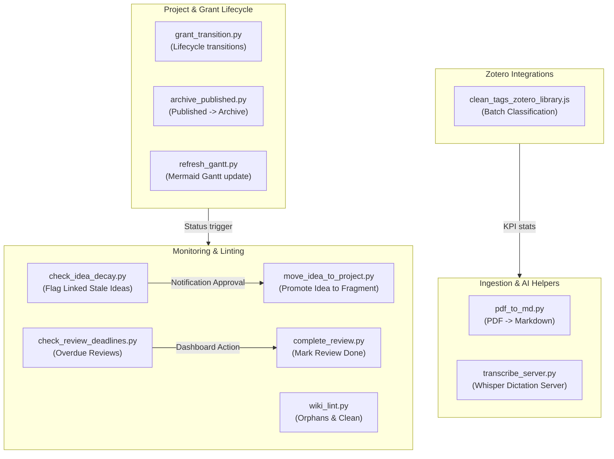

# Automation Scripts (`_scripts/automation/`)

This directory contains automated workflows and utility scripts that maintain the vault's integrity, manage project lifecycles, track peer reviews, run voice dictation servers, and ingest literature.

> [!IMPORTANT]
> **LLM INSTRUCTION RULE:** Any AI agent/LLM modifying, adding, renaming, or deprecating a script in this directory **MUST** update this `README.md` file immediately to keep the script descriptions and metadata accurate.

---

## System Flow Diagram

---

## Categorized Script Catalog

### 📂 Project & Grant Lifecycle
Scripts managing states, lifecycles, and visual timelines of research projects and grants.

| Script | Schedule / Trigger | Purpose | Config / Dependencies |
|---|---|---|---|
| [`archive_published.py`](_scripts/automation/archive_published.py) | **08:00 daily** (launchd) | Moves `status: published` projects from `01_PROJECTS/` to `99_ARCHIVE/`. | Vault path (`01_PROJECTS/`, `99_ARCHIVE/`) |
| [`refresh_gantt.py`](_scripts/automation/refresh_gantt.py) | **08:10 daily** (launchd) | Rewrites Mermaid Gantt charts in active `_project.md` files based on Nig Student-t estimations. | `posteriors.json` |
| [`grant_transition.py`](_scripts/automation/grant_transition.py) | **Manual** | Atomically updates status directories for grant applications under `02_GRANTS/`. | Vault path (`02_GRANTS/`) |
| [`move_idea_to_project.py`](_scripts/automation/move_idea_to_project.py) | **Dashboard Approve / Reject** | `--project` promotes a linked idea to the project's `_fragments` directory; `--discard` rejects it to `00_STAGING/ideas/_discarded/` and sets `status: discarded`. | Destination check, frontmatter update |

### 🛠️ Integrity, Linting & Monitoring
Scripts checking for metadata errors, broken structures, or overdue tasks.

| Script | Schedule / Trigger | Purpose | Config / Dependencies |
|---|---|---|---|
| [`wiki_lint.py`](_scripts/automation/wiki_lint.py) | **17:00 daily** (launchd) | Dry-runs checks on `wiki/` and `03_KNOWLEDGE/` and writes proposals to the Dashboard. | `notifications.json` |
| [`check_review_deadlines.py`](_scripts/automation/check_review_deadlines.py) | **09:00 daily** (launchd) | Scans `09_PEER_REVIEWS/` for past-due review rounds and updates the Dashboard. | `notifications.json` |
| [`complete_review.py`](_scripts/automation/complete_review.py) | **Dashboard Action** (via Notification Center) | Marks a peer review as completed by updating its metadata in the target markdown file. Created to enable direct completion from the dashboard. | Vault path (`09_PEER_REVIEWS/`) |
| [`check_idea_decay.py`](_scripts/automation/check_idea_decay.py) | **17:00 daily** (launchd) | Flags project-linked ideas in staging older than 30 days and sends alerts to Dashboard. | `notifications.json` |

### 📝 Ingestion & AI Helpers
Interactive scripts processing external inputs (PDFs, voice recordings) into clean Markdown.

| Script | Schedule / Trigger | Purpose | Config / Dependencies |
|---|---|---|---|
| [`pdf_to_md.py`](_scripts/automation/pdf_to_md.py) | **Manual** | Converts input PDF paper/notes to Literature Markdown schemas. | `marker` / Ollama / Gemini APIs |
| [`transcribe_server.py`](_scripts/automation/transcribe_server.py) | **Manual** (HTTP Server) | Starts local port `11435` Whisper server to process microphone inputs into note sections (live conference recording). | Whisper model, Ollama |
| [`transcribe_file.py`](_scripts/automation/transcribe_file.py) | **Manual** (Templater: `transcribe-audio.md`, System & Utilities) | Transcribes an EXISTING audio file embedded in a note (`![[file.m4a]]`) with Whisper + Ollama and stamps the cleaned transcript right under its embed. Reports live progress into the Home Notification Center (`notifications.json`). Standalone — shares no code with `transcribe_server.py`. | Whisper model, Ollama, ffmpeg |

### 🏷️ Zotero Integrations
Scripts running inside the Zotero desktop app to clean or manage libraries.

| Script | Schedule / Trigger | Purpose | Config / Dependencies |
|---|---|---|---|
| [`clean_tags_zotero_library.js`](_scripts/automation/clean_tags_zotero_library.js) | **Manual** (Zotero script) | Classifies historical papers in Zotero into taxonomy tags. | Ollama cloud API / key |
