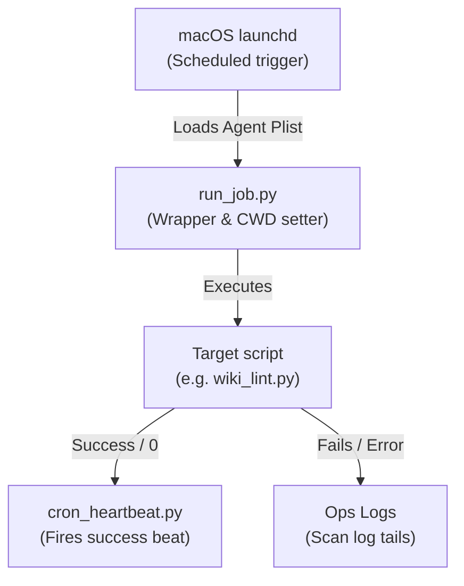

# Cron & Scheduler Utilities (`_scripts/cron/`)

This directory houses the scheduling infrastructure. It uses macOS `launchd` LaunchAgents to trigger automated workflows, wrap executions, and record success logs.

> [!IMPORTANT]
> **LLM INSTRUCTION RULE:** Any AI agent/LLM modifying, adding, renaming, or deprecating a script in this directory **MUST** update this `README.md` file immediately to keep the script descriptions and scheduler registration details accurate.

---

## Execution Chain Flowchart

---

## Categorized Script Catalog

### ⚙️ Scheduler Core
Core files responsible for configuring plist files and wrapping execution environments.

| Script | Schedule / Trigger | Purpose | Config / Dependencies |
|---|---|---|---|
| [`setup_launchd.py`](_scripts/cron/setup_launchd.py) | **Manual** | Installs, removes, and lists system plist LaunchAgents under `~/Library/LaunchAgents/`. | `launchctl` |
| [`run_job.py`](_scripts/cron/run_job.py) | **Automatic** (launchd) | Ensures CWD is correct, pipes script logs, and writes heartbeats upon success. | Python executable |

### 🔔 Utility & Alerts
Scripts for formatting and firing notifications and reminders.

| Script | Schedule / Trigger | Purpose | Config / Dependencies |
|---|---|---|---|
| [`send_notification.py`](_scripts/cron/send_notification.py) | **Manual / CLI** | Utility script to post custom notifications to the dashboard. | `notifications.json` |
| [`work_life_balance.sh`](_scripts/cron/work_life_balance.sh) | **17:00 Mon-Fri** | Fires a desktop banner reminder to wrap up work. | macOS Notification API |

---

## Active Schedules

All schedules run under `run_job.py` wrapper, configured in `setup_launchd.py`:

| Agent | Target Script | Time | Purpose |
|---|---|---|---|
| `health_check` | `_scripts/ops/health_check.py` | 07:55 daily | Self-observability checks |
| `archive_published` | `_scripts/automation/archive_published.py` | 08:00 daily | Move published projects to Archive |
| `update_posteriors` | `_scripts/ml/update_posteriors.py` | 08:05 daily | Recalculate posterior task durations |
| `refresh_gantt` | `_scripts/automation/refresh_gantt.py` | 08:10 daily | Rebuild Gantt charts in notes |
| `check_review_deadlines` | `_scripts/automation/check_review_deadlines.py` | 09:00 daily | Notify overdue peer reviews |
| `kpi_collector` | `_scripts/kpi/collector.py` | 17:00 daily | Query Zotero and update KPI database |
| `wiki_lint` | `_scripts/automation/wiki_lint.py` | 17:00 daily | Proposed wiki cleaning dry-run |
| `check_idea_decay` | `_scripts/automation/check_idea_decay.py` | 17:00 daily | Scan and prompt stale project-linked ideas |
| `work_life_balance` | `_scripts/cron/work_life_balance.sh` | Mon–Fri 17:00 | Desktop notification reminder |
