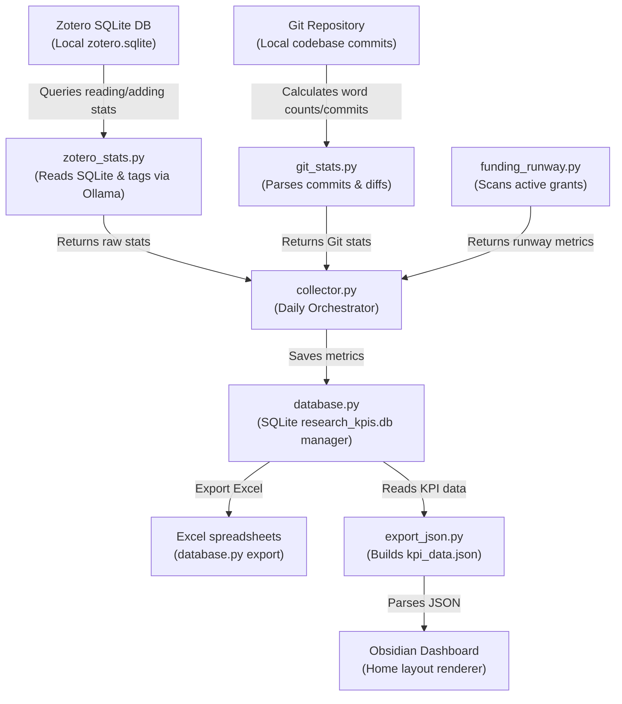

# KPI Pipeline (`_scripts/kpi/`)

This directory contains the pipeline responsible for tracking academic metrics, querying Zotero databases, computing funding runways, and saving Key Performance Indicators (KPIs) into SQLite.

> [!IMPORTANT]
> **LLM INSTRUCTION RULE:** Any AI agent/LLM modifying, adding, renaming, or deprecating a script in this directory **MUST** update this `README.md` file immediately to keep the script descriptions and schema mapping accurate.

---

## KPI Data Flow

---

## Categorized Script Catalog

### 🗄️ Database & Orchestration
Core scripts running the collector process and interacting with the local SQLite data engine.

| Script | Schedule / Trigger | Purpose | Config / Dependencies |
|---|---|---|---|
| [`collector.py`](_scripts/kpi/collector.py) | **17:00 daily** (launchd) | Main driver. Calls Zotero query engines, fetches metrics, and writes to database. | SQLite, `zotero_stats.py`, `git_stats.py` |
| [`database.py`](_scripts/kpi/database.py) | **Manual** (CLI) | Creates database schema, handles updates, and exports reports: `database.py export`. | `pandas`, `openpyxl`, SQLite |
| [`export_json.py`](_scripts/kpi/export_json.py) | **Automatic** (from collector) | Aggregates SQLite metrics into `kpi_data.json` for Home charts. | `research_kpis.db` |

### 🔍 Zotero Query & Classification (Python)
Scripts that scan Zotero's local database and process classifications.

| Script | Schedule / Trigger | Purpose | Config / Dependencies |
|---|---|---|---|
| [`zotero_stats.py`](_scripts/kpi/zotero_stats.py) | **Automatic** (from collector) | Queries Zotero SQLite for daily additions/reads, classifying items via Ollama. | `tag_prompt.txt`, Ollama |
| [`zotero_highlights.py`](_scripts/kpi/zotero_highlights.py) | **Manual** (CLI) | CLI tool to perform bulk exports of highlighted notes from Zotero PDFs. | Zotero file attachments |
| [`tag_prompt.txt`](_scripts/kpi/tag_prompt.txt) | *Runtime Config* | Prompt template containing disambiguation rules for AI classification. | Used by `zotero_stats.py` |

### 🔌 Zotero Integration (JavaScript)
Scripts loaded inside the desktop Zotero app to trigger actions or export notes.

| Script | Schedule / Trigger | Purpose | Config / Dependencies |
|---|---|---|---|
| [`zotero_actions_tags_script.js`](_scripts/kpi/zotero_actions_tags_script.js) | **createItem** (Zotero Event) | Automatically tags new papers inside Zotero at creation time. | Local Ollama |
| [`zotero_actions_tags_export.js`](_scripts/kpi/zotero_actions_tags_export.js) | **Manual / Shortcut** (Zotero) | Exports PDF annotations and AI synthesis directly into Obsidian Markdown notes. | `gpt-oss:120b-cloud` / Ollama |

### 💰 Financial Runway
Metrics related to funding pipelines and allocations.

| Script | Schedule / Trigger | Purpose | Config / Dependencies |
|---|---|---|---|
| [`funding_runway.py`](_scripts/kpi/funding_runway.py) | **Automatic** (from collector) | Scans `02_GRANTS/` proposals to calculate runway months and pipeline budgets. | `02_GRANTS/active/` |

### 💻 Git Repository Statistics
Metrics related to codebase writing stats and repository activity.

| Script | Schedule / Trigger | Purpose | Config / Dependencies |
|---|---|---|---|
| [`git_stats.py`](_scripts/kpi/git_stats.py) | **Automatic** (from collector) | Extracts daily words written (diff on `.md/.tex/.qmd`), commits, and notes created/modified. | Local Git repository |
