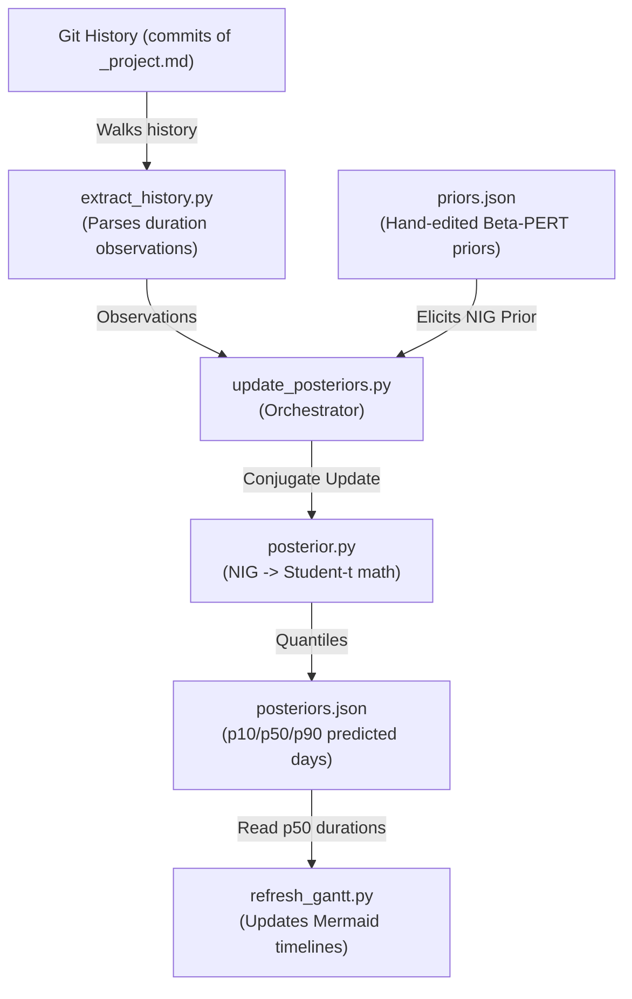

# Bayesian ML Forecasting (`_scripts/ml/`)

This directory contains the machine learning pipeline used to estimate research phase durations. It implements a conjugate Bayesian Normal-Inverse-Gamma (NIG) model to update prior task duration beliefs with historical data extracted from the vault's Git log history.

> [!IMPORTANT]
> **LLM INSTRUCTION RULE:** Any AI agent/LLM modifying, adding, renaming, or deprecating a script in this directory **MUST** update this `README.md` file immediately to keep the script descriptions and model documentation accurate.

---

## Architecture Flow

---

## File Catalog

### 1. `posterior.py`
- **Purpose**: Implements the mathematical formulas for the Bayesian Normal-Inverse-Gamma (NIG) conjugate update and posterior predictive quantiles.
- **Model details**:
  - Model durations $D_i$ on a log scale: $Y_i = \log D_i \sim \mathcal{N}(\mu, \sigma^2)$
  - Prior: Inverse-Gamma on variance $\sigma^2 \sim \text{Inv-Gamma}(a_0, b_0)$, and Conditional Normal on mean $\mu|\sigma^2 \sim \mathcal{N}(\mu_0, \sigma^2 / \kappa_0)$.
  - Matches Beta-PERT three-point estimates $(O, ML, P)$ from `priors.json` to log-Normal parameters by moment matching.
  - Posterior predictive distribution follows a location-scale Student-t distribution ($t_{2 a_n}$).

### 2. `extract_history.py`
- **Purpose**: Walks the Git commit history of the vault for all `_project.md` files, parses the `status:` transitions in frontmatter at each commit, and extracts completed phase durations in calendar days.

### 3. `update_posteriors.py`
- **Purpose**: Main orchestrator script that matches extracted observations with priors and updates `posteriors.json`.
- **Schedules**: Run automatically daily at **08:05** via launchd (`com.research-vault.update_posteriors`).
- **CLI Debugging Options**:
  - `python _scripts/ml/update_posteriors.py --show` (outputs posteriors JSON to console without writing).
  - `python _scripts/ml/update_posteriors.py --observations` (lists all parsed data tuples).
  - `python _scripts/ml/update_posteriors.py --project <CODE>` (predicts calendar dates and schedules for a specific project).

### 4. `priors.json`
- **Purpose**: Elicited prior parameters in Beta-PERT $(O, ML, P)$ format per `(role × phase)` cell (e.g. Lead role vs. Not-lead, across Data Collection `dc`, Data Processing `dr`, and Writing `ir`). Committed and hand-edited.

### 5. `posteriors.json`
- **Purpose**: Generated file containing NIG posterior parameters, observation counts ($n$), and final predictive quantiles (`p10_days`, `p50_days`, `p90_days`) used to draw visual schedules. **Git-ignored, regenerated daily**.
